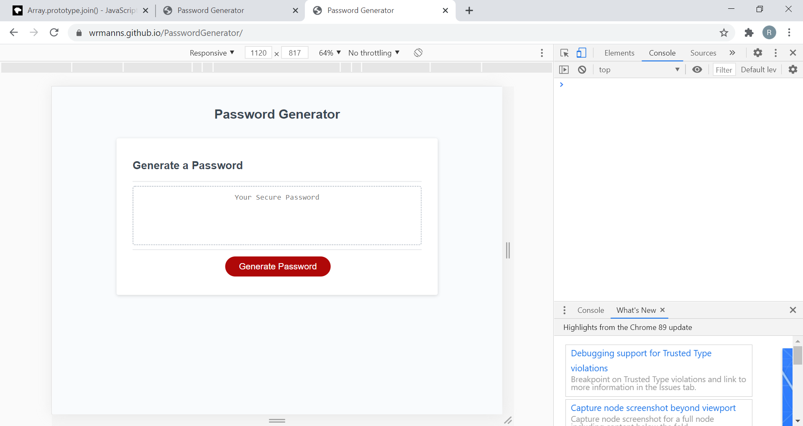
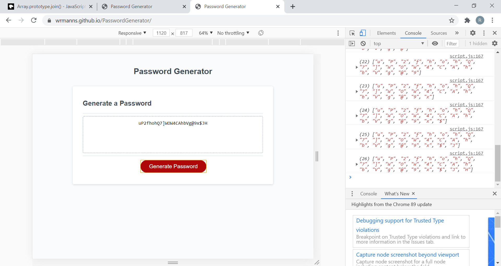

***Random Password Generator***

User clicks on the Generate Password Button
User is prompted to enter a password length between 8 and 100 characters
User is prompted to choose to include Lower Cased Characters
User is prompted to choose to include Upper Cased Characters
User is prompted to choose to include Numeric Characters
User is prompted to choose to include Special Characters

If no characters are selected, User is alerted and function ends

Character arrays are chosen based on User's confims and concatenated into one array

Concatted array is used to pull random charactes from and placed in new array
New array is displayed in the card for User to retrieve

Repo:
https://github.com/WRManns/PasswordGenerator

Deployed App:
https://wrmanns.github.io/PasswordGenerator/

